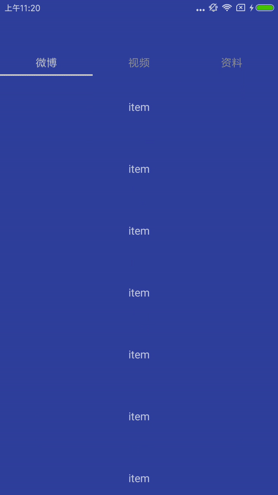

**一.使用**

 1.values下新建values.xml

     <item name="id_sticky_layout_topview" type="id"/>//上部渐变view的id
        <item name="id_sticky_layout_viewpager" type="id"/> //下部滑动viewpager的id
        <item name="id_sticky_layout_indicator" type="id"/>  //Tab指示器 布局id
        <item name="id_sticky_layout_inner_scrollview" type="id"/>//下部viewpager 内布局id

2.xml: 最外层GaussPager

    <com.shing.blurstickytab.utils.BlurStickyView xmlns:android="http://schemas.android.com/apk/res/android"
        android:layout_width="match_parent"
        android:orientation="vertical"
        android:layout_height="match_parent">
        </com.shing.blurstickytab.utils.BlurStickyView>

3.对应第一步骤  设置各个控件的id

**二.示例**
<!--  -->

